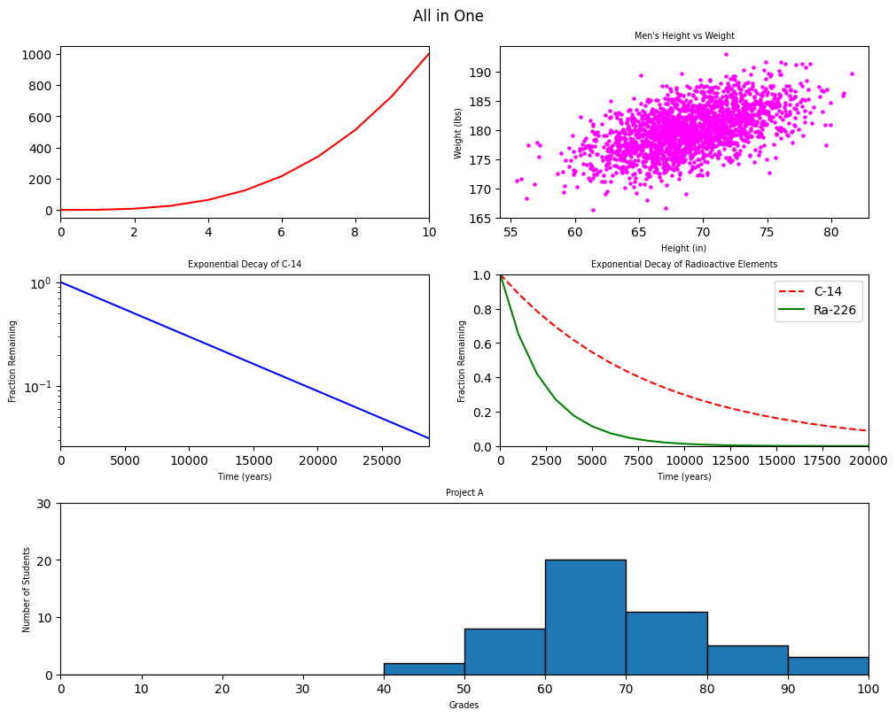

# ML Pipeline Foundations

A collection of machine learning engineering exercises built from the ground up, math, data pipelines, and the plumbing that sits underneath any real ML system, completed as part of the AI Academy at Digital Learning Hub Luxembourg (Holberton School ML Engineering curriculum).

---

## About This Project

Most ML tutorials start from `model.fit()`. This repository starts earlier than that: with the math and data-handling foundations underneath it, implemented from scratch rather than imported from a library, specifically so the library calls stop feeling like magic once they're used later.

## The Story

The math/ folder is the part that actually changed how I think about models. Working through Bayesian probability meant implementing likelihood, intersection, marginal probability, and posterior calculations under strict constraints (NumPy only for the early files, scipy.special only once Beta-Binomial conjugacy came into play), which forced an understanding of what a posterior actually is rather than just calling a function that returns one. The advanced linear algebra tasks were similar: building the adjugate, inverse, definiteness check, and determinant of a matrix from scratch made it obvious why `numpy.linalg.inv()` can fail silently on a near-singular matrix, something that's easy to miss when you've never had to compute it by hand.

The pipeline/ folder is the other half of the story: the unglamorous but necessary work of getting data from a database or an API into a shape pandas can actually use, before any modeling happens at all.

## What's Implemented

- Bayesian probability from scratch: likelihood, intersection, marginal, posterior, and Beta-Binomial conjugacy
- Multivariate probability: joint PMFs, covariance matrices, correlation, multivariate Gaussian PDF
- Advanced linear algebra from scratch: adjugate, inverse, definiteness, determinant
- Foundational probability distributions (Normal, Poisson, Exponential, Binomial) implemented from scratch
- Calculus exercises and matplotlib plotting tasks
- Database and API access patterns for pulling data into a pipeline
- Pandas data cleaning and transformation exercises

## What's Next

- Wire the pipeline/ modules together into one end-to-end script: API pull to database write to pandas cleaning
- Add unit tests for the math functions to lock in correctness against scipy/numpy references
- Package the linear algebra utilities as a small installable module
## The Hardest Part

Getting the math right without the safety net of a library function to check against. Every task in math/ had to pass pycodestyle and, more importantly, had to be verified by hand against known values before trusting it, since there's no `assert np.allclose()` shortcut when you're the one implementing the thing numpy would normally give you for free. The Bayesian probability tasks were the strictest version of this: file 4 (Beta-Binomial conjugacy) was only allowed to use scipy.special, everything before it had to be pure NumPy, which meant working out the math by hand before writing a single line of code.

## Tools

Python, NumPy, pandas, SciPy, SQL, matplotlib

## About the Developer

**Khadija**, Data Analyst based in Luxembourg, currently in the AI Academy at Digital Learning Hub Luxembourg, training as an ML Engineer.
[LinkedIn](https://www.linkedin.com/in/khadija-mustafa-98344527b/) · [Portfolio](https://khadijatheanalyst.github.io) · [GitHub](https://github.com/KhadijaTheAnalyst)
